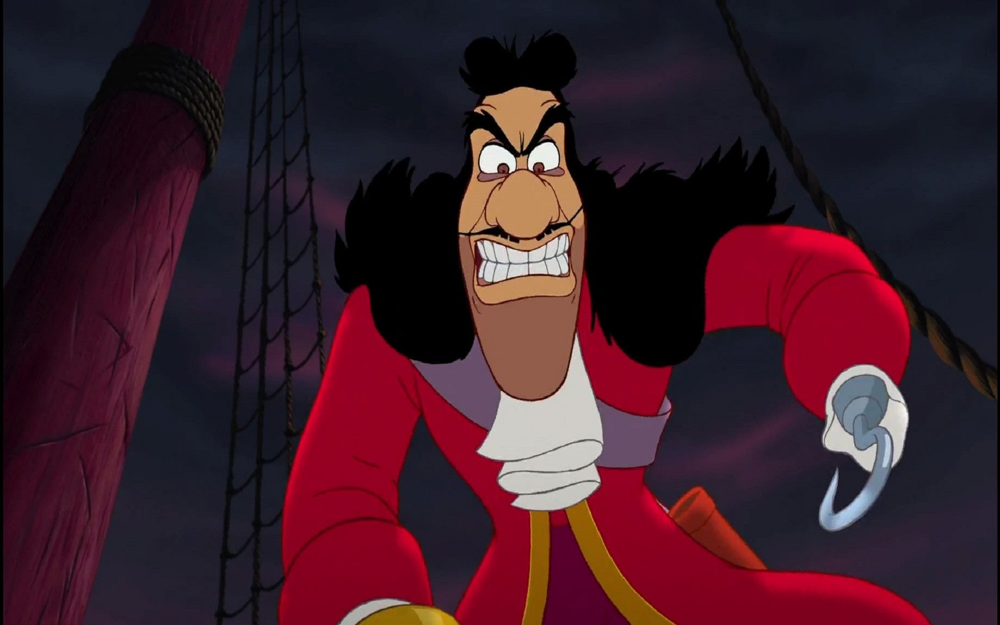

[](https://travis-ci.org/kcmerrill/hook)


# Hook

Add hooks, register events or filter data.

```golang
func TestPriorityOrder(t *testing.T) {
	Register("wordp", 3, func(word *string) {
		*word += "c"
	})
	Register("wordp", 1, func(word *string) {
		*word += "a"
	})
	Register("wordp", 2, func(word *string) {
		*word += "b"
	})

	wordp := ""
	Trigger("wordp", &wordp)
	if wordp != "abc" {
		log.Fatalf("abc was expected")
	}
}

func TestOrder(t *testing.T) {
	Register("word", func(word *string) {
		*word += "c"
	})
	Register("word", func(word *string) {
		*word += "a"
	})
	Register("word", func(word *string) {
		*word += "b"
	})
	word := ""
	Filter("word", &word)
	if word != "cab" {
		log.Fatalf("cab was expected")
	}
}
```